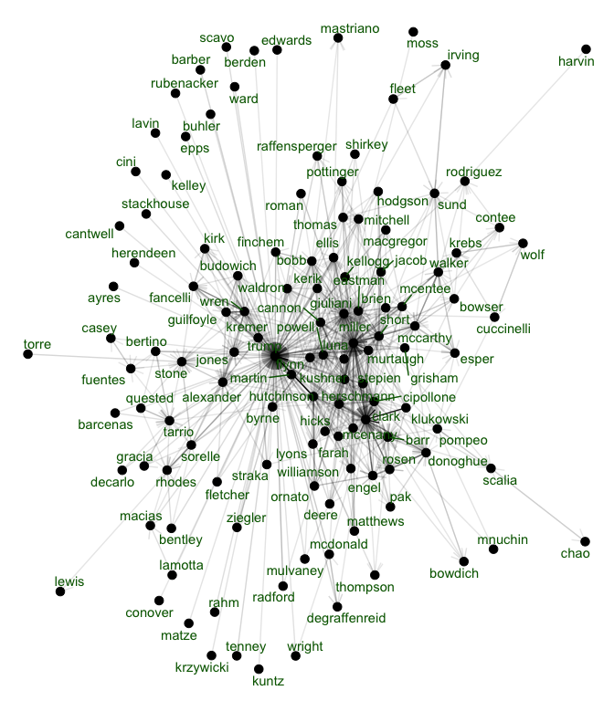
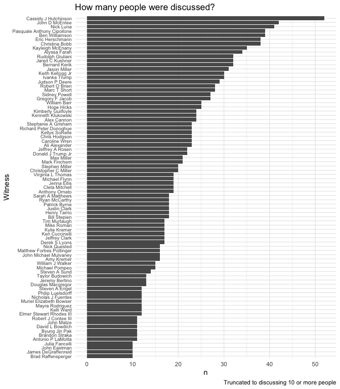

January 6 Committee Transcript Text Processing
================
Peter Rabinovitch
2023-01-05 11:24:18

``` r
library(tidyverse)
library(tictoc)
library(lubridate)
library(knitr)
library(janitor)
library(ggthemes)
library(ggridges)
library(tidytext)
library(tidyr)
library(wordcloud)
library(pdftools)
library(stringi)
library(cleanNLP)
library(patchwork)
library(scales)
library(tesseract)
library(igraph)
library(ggraph)
```

# Intro

Here we do some basic text processing on the testimonies for the January
6 Committee. All files were downloaded from
www.axios.com/2022/12/29/jan-6-committee-latest-transcript-interviews
and stored in one folder. They are pdf files, but each page is an image,
not text, so we use tesseract.

Tesseract works by converting the pdf (image) files to png files, one
png per page. Then it does the ocr on the text of each page. We then
munge it a little, remove the png files, and write the resulting ocr’d
text to a csv.

Note we did this, we do NOT do it here as it takes roughly 10 minutes
per file.

# Data munging

## PDF to csv

``` r
fns <- list.files() %>%
  enframe() %>%
  rename(file_name = value)

fns_pdf <- fns %>% filter(str_detect(file_name, "\\.pdf$"))

fns_pdf <- fns_pdf %>% arrange(file_name)

process_file <- function(fn) {
  text_2 <- ocr(fn, engine = eng)
  content_2_df <- text_2 %>%
    map(stri_split_lines) %>%
    flatten() %>%
    flatten_chr() %>%
    as_tibble() %>%
    rowid_to_column("doc_index") %>%
    rename(text = value) %>%
    filter(text != "") %>%
    mutate(file_name = fn)
  junk <- dir(pattern = "*.png")
  file.remove(junk)
  fn2 <- str_c(fn, ".csv")
  content_2_df %>% write.csv(fn2)
}

for (i in 1:nrow(fns_pdf)) {
  fn <- fns_pdf$file_name[i]
  print(paste0("starting file ", i))
  process_file(fn)
}
```

We get the names of the csv files and create two data frames:  
- words_to_remove_df which contains, for each file (witness) their name,
so that it can be removed from their transcript. In other words, when we
look at Ivanka’s transcript, we are not interested in the fact that her
name is all through the transcript, so we remove it.  
- witness_dates_df: for each transcript we record the witness’ name to
make it easier to later do things like look at the sentiment of a
particular witness’ testimony on different dates.

## get words_to_remove_df and witness_dates_df

``` r
fns <- list.files() %>%
  enframe() %>%
  rename(file_name = value)

fns_csv <- fns %>% filter(str_detect(file_name, "\\.pdf\\.csv$"))

words_to_remove_df <- fns_csv %>%
  mutate(fn = str_replace_all(file_name, "\\d", " ")) %>%
  mutate(fn = str_replace_all(fn, "[:punct:]", " ")) %>%
  mutate(fn = str_replace_all(fn, "csv", " ")) %>%
  mutate(fn = str_replace_all(fn, "pdf", " ")) %>%
  unnest_tokens(nm, fn) %>%
  filter(stri_length(nm) >= 2) %>%
  filter(nm != "jr") %>%
  filter(nm != "iii") %>%
  filter(nm != "redacted") %>%
  filter(nm != "compressed")

witness_dates_df <- fns_csv %>%
  mutate(
    witness = str_sub(file_name, 10),
    witness = str_replace(witness, "\\.pdf\\.csv", "")
  ) %>%
  mutate(
    yr = str_sub(file_name, 1, 4) %>% as.numeric(),
    mo = str_sub(file_name, 5, 6) %>% as.numeric(),
    da = str_sub(file_name, 7, 8) %>% as.numeric(),
    dt = make_date(yr, mo, da)
  ) %>%
  select(-yr, -mo, -da, -name) %>%
  mutate(witness = str_replace_all(witness, "Redacted", " ")) %>%
  mutate(witness = str_replace_all(witness, "Compressed", " ")) %>%
  mutate(witness = str_replace_all(witness, "FINAL", " ")) %>%
  mutate(witness = str_replace_all(witness, "REDACTED2", " ")) %>%
  mutate(witness = str_replace_all(witness, "Redacted2", " ")) %>%
  mutate(witness = str_replace_all(witness, "REDACTED2", " ")) %>%
  mutate(witness = str_replace_all(witness, "REDACTED", " ")) %>%
  mutate(witness = str_replace_all(witness, "\\d", " ")) %>%
  mutate(witness = str_replace_all(witness, "[:punct:]", " ")) %>%
  mutate(witness = str_squish(witness))
```

## csv to \_tidied.csv

Next we use cleanNLP to do a bunch of text processing, file by file, and
write a tidied csv for each original csv.

The only funky thing we do is replace some names to make it easier to
disambiguate later. For example, if the original document said
*President Biden* we wouldn’t want to parse that into *President* and
*Biden* because we might confuse this occurrence of *President* with
another referring to Trump.

Again, we did this and do not repeat it here as it takes a while.

``` r
cnlp_init_udpipe()

for (k in 1:nrow(fns_csv)) {
  fncsv <- fns_csv$file_name[k]
  dft <- read_csv(fncsv)
  dft <- dft %>%
    mutate(doc_name = str_c(file_name, "#", doc_index)) %>%
    filter(str_squish(text) != "") %>%
    mutate(text = str_replace_all(text, "Vice President", "VicePresident")) %>%
    mutate(text = str_replace_all(text, "President Trump", "PresidentTrump")) %>%
    mutate(text = str_replace_all(text, "President Biden", "PresidentBiden")) %>%
    mutate(text = str_replace_all(text, "Ivanka Trump", "IvankaTrump")) %>%
    mutate(text = str_replace_all(text, "Eric Trump", "EricTrump")) %>%
    mutate(text = str_replace_all(text, "Don Jr", "DonJr")) %>%
    mutate(text = str_replace_all(text, "Donald Trump", "PresidentTrump"))

  dft2 <- dft %>% cnlp_annotate(text_name = "text", doc_name = "doc_name")

  docs_df <- dft2$token %>%
    select(doc_id, token, upos, lemma) %>%
    left_join(
      dft2$document %>% select(doc_id, file_name, doc_index),
      by = c("doc_id" = "doc_id")
    ) %>%
    select(file_name, doc_index, token, upos, lemma)

  docs_df <- docs_df %>%
    filter(upos != "PUNCT") %>%
    filter(upos != "SYM") %>%
    filter(upos != "X") %>%
    filter(upos != "INTJ") %>%
    filter(upos != "NUM") %>%
    filter(upos != "ADP") %>%
    filter(upos != "DET") %>%
    filter(upos != "CCONJ") %>%
    filter(upos != "PART") %>%
    filter(upos != "SCONJ") %>%
    filter(upos != "PRON")

  tidy_df <- docs_df %>%
    select(file_name, doc_index, lemma, token) %>%
    mutate( # eliminate any numbers
      lemma = str_replace_all(lemma, "\\d", " "),
      token = str_replace_all(token, "\\d", " ")
    )

  tidy_df <- tidy_df %>%
    mutate(
      lemma = str_replace_all(lemma, "[:punct:]", " "),
      token = str_replace_all(token, "[:punct:]", " ")
    )

  # eliminate empty words
  tidy_df <- tidy_df %>%
    filter(str_squish(lemma) != "", str_squish(token) != "")

  # eliminate one or two letter words
  tidy_df <- tidy_df %>%
    filter(str_length(token) > 2)

  # eliminate stop words
  tidy_df <- tidy_df %>%
    anti_join(stop_words, by = c("lemma" = "word")) %>%
    anti_join(stop_words, by = c("token" = "word"))

  # convert everything to lower case
  tidy_df <- tidy_df %>%
    mutate(lemma = str_to_lower(lemma), token = str_to_lower(token))

  tidy_df <- tidy_df %>%
    mutate(word = str_squish(lemma)) %>%
    select(-lemma, -token)
  tidy_df <- tidy_df %>% filter(str_length(word) > 2)
  tidy_df <- tidy_df %>% anti_join(words_to_remove_df %>% filter(file_name == fncsv), by = c("word" = "nm"))

  fn_out <- str_replace(fncsv, "\\.pdf", "_tidied")
  tidy_df %>% write_csv(fn_out)
}
```

So now we have a bunch of tidied files that look like, for example:
file_name doc_index word  
<chr> <dbl> <chr>  
1 20221129_Anthony Ornato (1).pdf 5 committee  
2 20221129_Anthony Ornato (1).pdf 5 investigate 3 20221129_Anthony
Ornato (1).pdf 6 attack  
4 20221129_Anthony Ornato (1).pdf 6 u s  
5 20221129_Anthony Ornato (1).pdf 6 capitol  
6 20221129_Anthony Ornato (1).pdf 7 u s

# Results

``` r
fns <- list.files() %>%
  enframe() %>%
  rename(file_name = value)

fns_tidied <- fns %>% filter(str_detect(file_name, "_tidied\\.csv$"))

df <- tibble()
for (k in 1:nrow(fns_tidied)) {
  fn <- fns_tidied$file_name[k]
  dft <- read_csv(fn)
  df <- df %>% bind_rows(dft)
}

names_df <- witness_dates_df %>%
  mutate(name = str_replace_all(witness, "\\d", " ")) %>%
  mutate(name = str_replace_all(name, "[:punct:]", " ")) %>%
  mutate(name = str_replace_all(name, "Jr", " ")) %>%
  mutate(name = str_replace_all(name, "III", " ")) %>%
  mutate(name = str_squish(name)) %>%
  mutate(lastname = str_extract(name, "\\b(\\w+)$") %>% str_to_lower()) %>%
  select(lastname)

witness_dates_df <- witness_dates_df %>%
  mutate(
    wln = str_replace_all(witness, " Jr$", ""),
    wln = str_replace_all(wln, " III$", ""),
    wln = str_squish(wln),
    wln = str_extract(wln, "\\b(\\w+)$") %>% str_to_lower()
  )

matches <- df %>%
  inner_join(names_df, by = c("word" = "lastname")) %>%
  left_join(witness_dates_df %>% mutate(fn = str_replace_all(file_name, "\\.csv", "")), by = c("file_name" = "fn")) %>%
  select(wln, word) %>%
  count(wln, word, sort = TRUE)
```

``` r
matches %>%
  filter(n >= 10) %>%
  graph_from_data_frame(directed = TRUE) %>%
  ggraph(layout = "fr") +
  geom_edge_link(aes(edge_alpha = n), arrow = arrow(length = unit(4, "mm"))) +
  geom_node_point(size = 3) +
  geom_node_text(aes(label = name), colour = "darkgreen", repel = TRUE, point.padding = unit(0.2, "lines")) +
  theme_void() +
  theme(legend.position = "none")
```

<!-- -->

``` r
wlns <- matches$wln %>%
  unique() %>%
  sort()

matches2 <- df %>%
  inner_join(names_df, by = c("word" = "lastname")) %>%
  left_join(witness_dates_df %>% mutate(fn = str_replace_all(file_name, "\\.csv", "")), by = c("file_name" = "fn")) %>%
  select(witness, word) %>%
  count(witness, word, sort = TRUE)

matches2 %>%
  count(witness, word) %>%
  ungroup() %>%
  count(witness, sort = TRUE) %>%
  filter(n >= 10) %>%
  ggplot(aes(x = reorder(witness, n), y = n)) +
  geom_bar(stat = "identity") +
  coord_flip() +
  theme_minimal() +
  theme(axis.text.y = element_text(size = 7)) +
  labs(x = "Witness", title = "How many people were discussed?", y = "n", caption = "Truncated to discussing 10 or more people")
```

<!-- -->

``` r
matches2 %>%
  count(witness, word) %>%
  ungroup() %>%
  count(word, sort = TRUE) %>%
  filter(n >= 10) %>%
  filter(!(word %in% c("short"))) %>%
  ggplot(aes(x = reorder(word, n), y = n)) +
  geom_bar(stat = "identity") +
  coord_flip() +
  theme_minimal() +
  theme(axis.text.y = element_text(size = 7)) +
  labs(
    x = "Person", title = "Everybody talked about Trump",
    subtitle = "How many people discussed each person ?", y = "n",
    caption = "Truncated to being discussed by 10 or more people\n'Short' removed as it is a common word in addition to being a name"
  )
```

<!-- -->

# Appendices

<details>
<summary>
References
</summary>
</details>
<details>
<summary>
SessionInfo
</summary>

``` r
sessionInfo()
```

    ## R version 4.1.2 (2021-11-01)
    ## Platform: x86_64-apple-darwin17.0 (64-bit)
    ## Running under: macOS Big Sur 10.16
    ## 
    ## Matrix products: default
    ## BLAS:   /Library/Frameworks/R.framework/Versions/4.1/Resources/lib/libRblas.0.dylib
    ## LAPACK: /Library/Frameworks/R.framework/Versions/4.1/Resources/lib/libRlapack.dylib
    ## 
    ## locale:
    ## [1] en_CA.UTF-8/en_CA.UTF-8/en_CA.UTF-8/C/en_CA.UTF-8/en_CA.UTF-8
    ## 
    ## attached base packages:
    ## [1] stats     graphics  grDevices utils     datasets  methods   base     
    ## 
    ## other attached packages:
    ##  [1] ggraph_2.0.5       igraph_1.3.0       tesseract_5.1.0    scales_1.2.0      
    ##  [5] patchwork_1.1.1    cleanNLP_3.0.4     stringi_1.7.8      pdftools_3.0.1    
    ##  [9] wordcloud_2.6      RColorBrewer_1.1-3 tidytext_0.3.2     ggridges_0.5.3    
    ## [13] ggthemes_4.2.4     janitor_2.1.0      knitr_1.39         lubridate_1.8.0   
    ## [17] tictoc_1.0.1       forcats_0.5.1      stringr_1.4.0      dplyr_1.0.9       
    ## [21] purrr_0.3.4        readr_2.1.1        tidyr_1.2.0        tibble_3.1.7      
    ## [25] ggplot2_3.3.6      tidyverse_1.3.1   
    ## 
    ## loaded via a namespace (and not attached):
    ##  [1] fs_1.5.2           bit64_4.0.5        httr_1.4.2         SnowballC_0.7.0   
    ##  [5] tools_4.1.2        backports_1.4.1    utf8_1.2.2         R6_2.5.1          
    ##  [9] DBI_1.1.1          colorspace_2.0-3   withr_2.5.0        gridExtra_2.3     
    ## [13] tidyselect_1.2.0   bit_4.0.4          compiler_4.1.2     cli_3.4.1         
    ## [17] rvest_1.0.2        xml2_1.3.3         labeling_0.4.2     askpass_1.1       
    ## [21] rappdirs_0.3.3     digest_0.6.29      rmarkdown_2.14.1   pkgconfig_2.0.3   
    ## [25] htmltools_0.5.2    highr_0.9          dbplyr_2.1.1       fastmap_1.1.0     
    ## [29] rlang_1.0.6        readxl_1.4.0       rstudioapi_0.13    generics_0.1.2    
    ## [33] farver_2.1.1       jsonlite_1.8.0     vroom_1.5.7        tokenizers_0.2.1  
    ## [37] magrittr_2.0.3     Matrix_1.4-1       Rcpp_1.0.9         munsell_0.5.0     
    ## [41] fansi_1.0.3        viridis_0.6.2      lifecycle_1.0.3    yaml_2.3.5        
    ## [45] snakecase_0.11.0   MASS_7.3-54        plyr_1.8.6         grid_4.1.2        
    ## [49] parallel_4.1.2     ggrepel_0.9.1      crayon_1.5.1       lattice_0.20-45   
    ## [53] graphlayouts_0.7.2 haven_2.4.3        hms_1.1.1          pillar_1.7.0      
    ## [57] reprex_2.0.1       glue_1.6.2         evaluate_0.15      qpdf_1.1          
    ## [61] modelr_0.1.8       vctrs_0.5.1        tzdb_0.2.0         tweenr_1.0.2      
    ## [65] cellranger_1.1.0   gtable_0.3.0       polyclip_1.10-0    assertthat_0.2.1  
    ## [69] xfun_0.30          ggforce_0.3.3      broom_1.0.0        tidygraph_1.2.0   
    ## [73] janeaustenr_0.1.5  viridisLite_0.4.0  ellipsis_0.3.2

</details>
